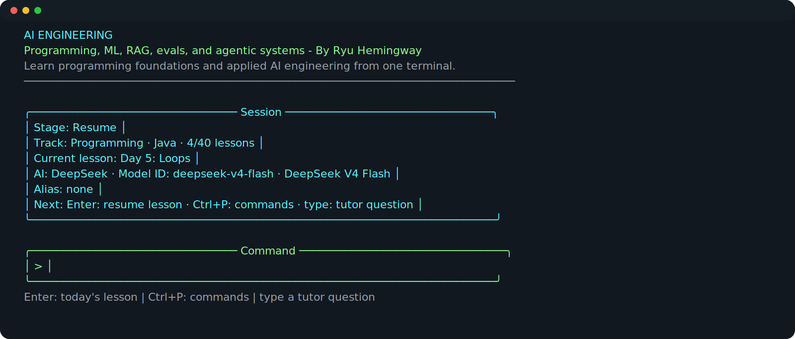
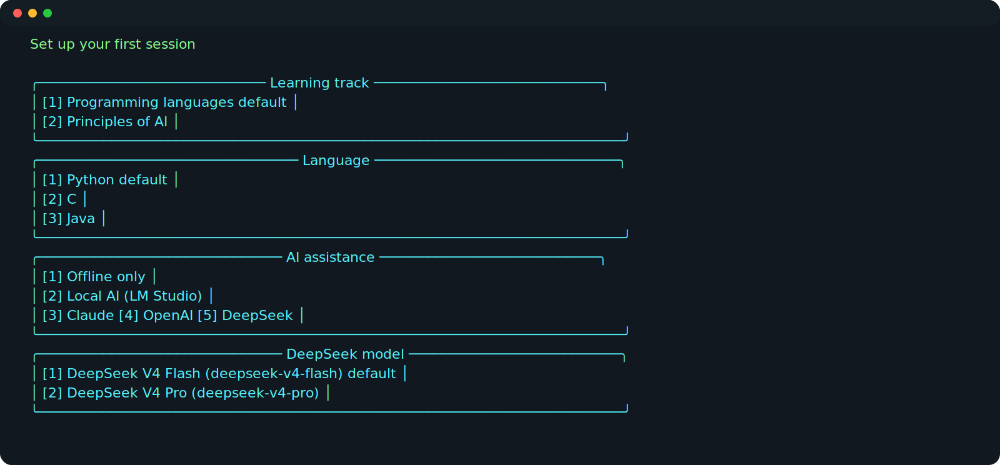
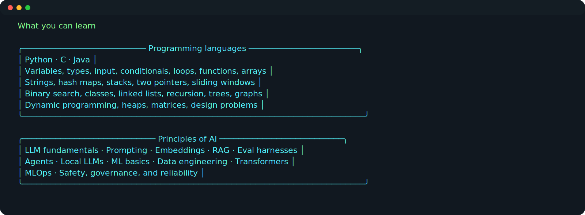
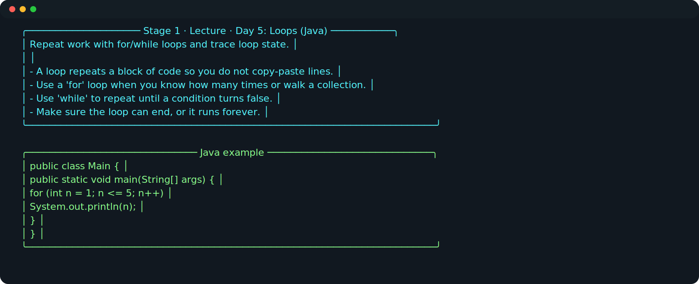
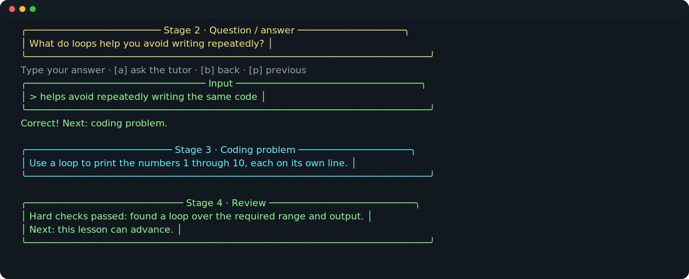
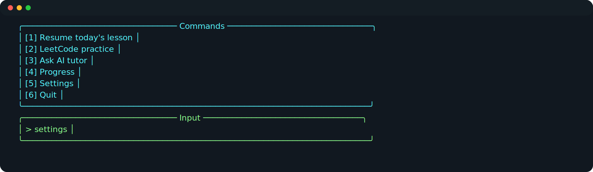

# Programming Fundamentals and AI

**Programming Fundamentals and AI - By Ryu Hemingway** is a terminal learning
app for programming fundamentals, AI engineering principles, and LeetCode
practice.

The app is designed to work offline first, then optionally use local or cloud
AI assistance when you want explanations, hints, or review.

```bash
Learn
```

## What It Includes

- Interactive terminal tutor with centered ANSI panels, boxed input, and a Ctrl+P command palette
- Programming track for Python, C, and Java
- Principles of AI track with 12 modules
- 200-problem LeetCode catalog with concept-gated unlocks
- Optional AI help from LM Studio, Claude, OpenAI, or DeepSeek with exact model identity shown in-session
- Local progress tracking so you can resume where you left off

## Quick Start

```bash
git clone <your-repo-url>
cd "Language and AI Principles by Ryu Hemingway"
python3 -m pip install -r requirements.txt
bash scripts/install.sh
Learn
```

First launch walks through the setup choices. Later launches show a compact
resume header with the active track, next lesson, provider, exact model ID, and
the next action. Press Enter to resume, or Ctrl+P to open commands.

## Demo Path

Run the built-in demo without touching your real progress:

```bash
bash scripts/demo.sh
```

It walks through first-run setup, opens a Python lesson, answers the quick
check, submits a small program, and shows deterministic code review.

## Screenshots

**Resume screen and primary command line**



**First-run setup, settings, and exact model selection**



**Available courses and modules**



**Lesson flow**



**Question, coding problem, and deterministic review**



**Command palette**



## Screen Recording

The animated walkthrough below shows the intended first-run to review loop.


To produce a real terminal recording locally, run the scripted path:

```bash
bash scripts/demo.sh
```

If `~/.local/bin` is not on your shell path, add this to `~/.zshrc` or
`~/.bashrc`:

```bash
export PATH="$HOME/.local/bin:$PATH"
```

## Main Commands

```bash
Learn
Learn --track programming --language python --ai offline
Learn --track programming --language c --ai local
Learn --track programming --language java --ai claude

Learn --track ai_principles --module rag
Learn --track ai_principles --module harnesses
Learn --track ai_principles --module agents
Learn --track ai_principles --module locallm

Learn leetcode stats
Learn leetcode next
Learn leetcode show 1
Learn --help
```

## Documentation

- [How To Use the App](HOWTO.md)
- [Configuration](docs/configuration.md)
- [Cloud API Keys](docs/cloud-api-keys.md)
- [Running Local LMs](docs/local-llms.md)
- [Programming Track](docs/programming-track.md)
- [Principles of AI Track](docs/principles-of-ai.md)
- [LeetCode Practice](docs/leetcode.md)
- [Development Notes](docs/development.md)
- [Security](SECURITY.md)

## Principles of AI Modules

- [LLM and Model API Fundamentals](docs/principles/llm-fundamentals.md)
- [Prompt and Context Engineering](docs/principles/prompting.md)
- [Embeddings and Vector Databases](docs/principles/embeddings.md)
- [RAG Fundamentals](docs/principles/rag.md)
- [Harnesses and Evaluation](docs/principles/harnesses.md)
- [Agentic Workflows](docs/principles/agentic-workflows.md)
- [Local LLM Fundamentals](docs/principles/local-llm-fundamentals.md)
- [Machine Learning Fundamentals](docs/principles/ml-basics.md)
- [AI Data Engineering](docs/principles/data-engineering.md)
- [Transformers and Deep Learning Basics](docs/principles/transformers.md)
- [AI Deployment and MLOps](docs/principles/mlops.md)
- [AI Safety, Security, and Privacy](docs/principles/safety.md)

## AI Provider Modes

| Mode | Requires Internet | Requires API Key | Notes |
| --- | --- | --- | --- |
| Offline | No | No | Lessons, quizzes, and local progress only |
| Local LM Studio | No after model download | No | Runs local models through LM Studio's localhost API |
| Claude | Yes | Anthropic API key | Strong cloud tutor assistance |
| OpenAI | Yes | OpenAI API key | Cloud model support via OpenAI-compatible chat endpoint |
| DeepSeek | Yes | DeepSeek API key | Choose `deepseek-v4-flash` or `deepseek-v4-pro`; legacy aliases are shown explicitly |

## Development Checks

```bash
python3 -m py_compile learn.py scripts/export_course_content.py scripts/generate_docs_media.py scripts/terminal_smoke.py
python3 scripts/terminal_smoke.py
bash scripts/check_generated_docs.sh
```

CI runs the same checks and fails if generated course docs or screenshot assets
drift from their generators.

## Repository Safety

Real credentials are intentionally ignored by Git. Copy the example config:

```bash
cp config.example.json config.json
```

Then add local keys only to `config.json` or use environment variables:

```bash
export ANTHROPIC_API_KEY="..."
export OPENAI_API_KEY="..."
export DEEPSEEK_API_KEY="..."
```

Do not commit `config.json`, `profile.md`, generated output, or saved progress.

## Project Layout

```text
Language and AI Principles by Ryu Hemingway/
  learn.py                    Main CLI app
  config.example.json          Public config template
  data/leetcode_catalog.json   200-problem practice catalog
  docs/                        User and curriculum documentation
  docs/assets/                 README/HOWTO screenshots and demo SVG
  .github/workflows/ci.yml      Compile, smoke, and generated-doc checks
  scripts/install.sh           Installs Learn/learn launchers
  scripts/demo.sh               Short scripted demo
  scripts/generate_docs_media.py Generates docs screenshot assets
  scripts/terminal_smoke.py     Automated terminal smoke tests
  requirements.txt             Python dependencies
```

## License

No license has been selected yet. Add a license before distributing this
publicly or accepting external contributions.
